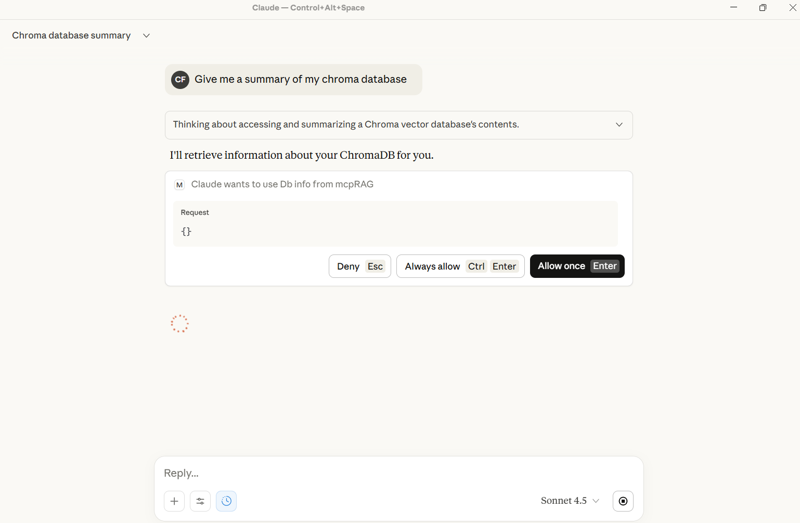
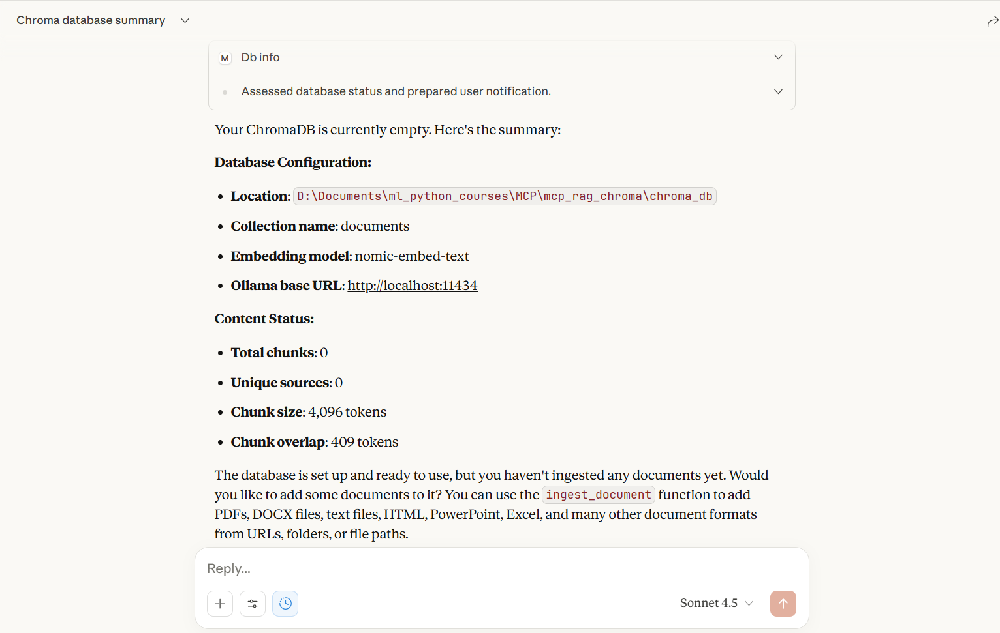
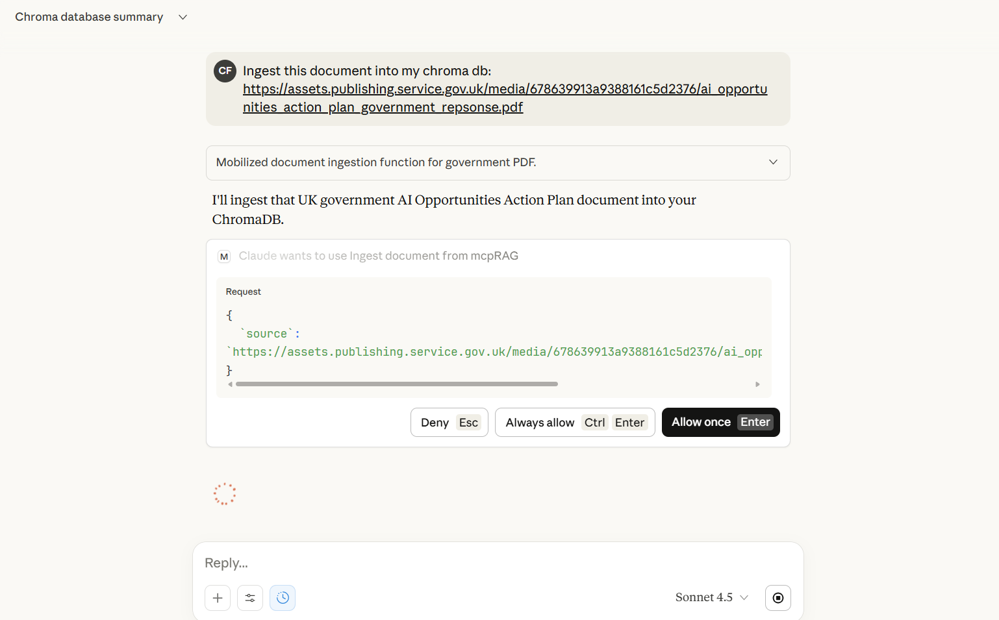
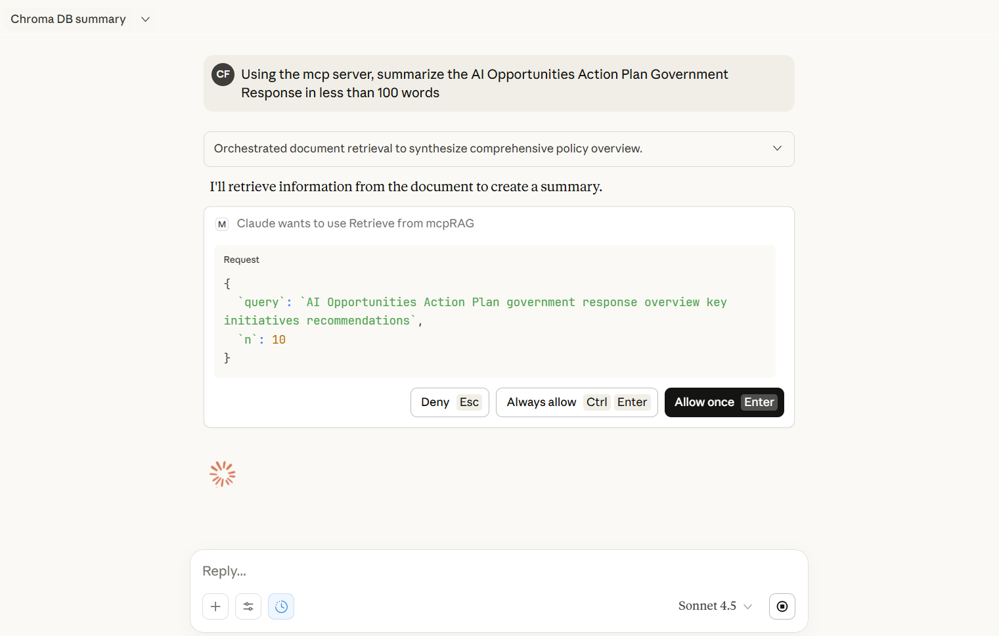
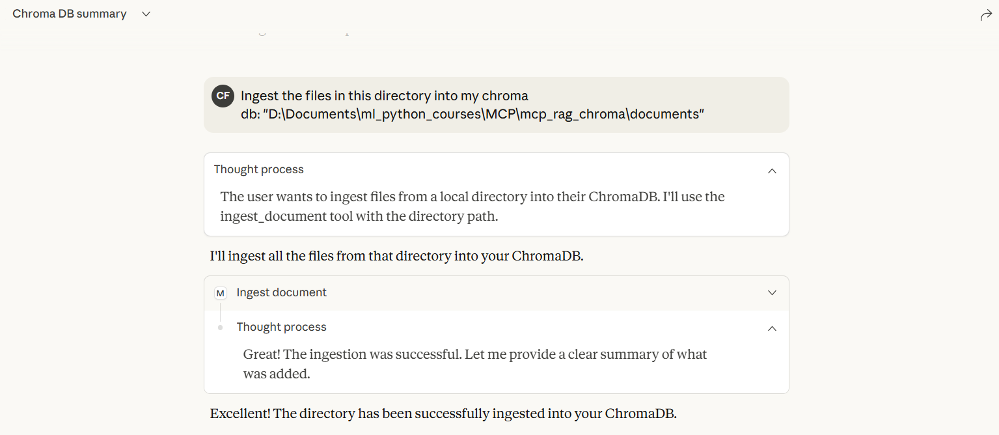
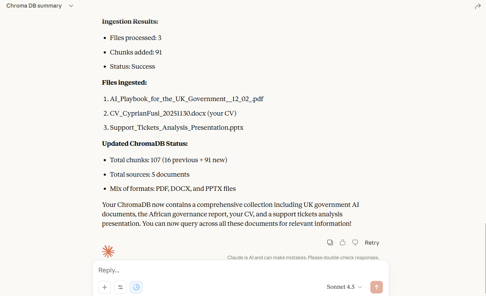

<div align="center">
  

  # MCP RAG with ChromaDB - Multi-Format Document Support

  _By **BINATI AInalytics**_
</div>

A powerful MCP (Model Context Protocol) server that provides RAG (Retrieval-Augmented Generation) capabilities with support for multiple document formats. Powered by LangChain, ChromaDB, with **OpenAI or Ollama embeddings**.

## Screenshots










## Embedding Options

Choose your embedding provider:

- **OpenAI** (Recommended for Claude Desktop/MCP) - Reliable, fast, cloud-based. See [OPENAI_SETUP.md](OPENAI_SETUP.md)
- **Ollama** (Free, Local) - No cost, runs locally, may have MCP connection issues

**Quick Start with OpenAI:**
1. Get API key from https://platform.openai.com/api-keys
2. Copy `.env.example` to `.env`
3. Set `OPENAI_API_KEY=sk-your-key-here`
4. Run `python server.py`

See [OPENAI_SETUP.md](OPENAI_SETUP.md) for detailed instructions.

## Supported Document Formats

- **PDF** (.pdf) - via PyPDF2
- **Microsoft Word** (.docx, .doc) - via python-docx
- **PowerPoint** (.pptx, .ppt) - via python-pptx
- **Excel** (.xlsx, .xls) - via openpyxl
- **OpenDocument Text** (.odt) - via odfpy
- **HTML** (.html, .htm) - via BeautifulSoup4
- **Plain Text** (.txt)
- **Markdown** (.md, .markdown)
- **CSV** (.csv)
- **JSON** (.json)
- **XML** (.xml)
- **RTF** (.rtf)

## Features

- Multi-format document ingestion with automatic format detection
- Vector storage using ChromaDB with persistent storage
- **Dual embedding support:** OpenAI (recommended for MCP) or Ollama (free, local)
- Concurrent document processing for improved performance
- Batch database writes for efficiency (OpenAI processes 100 docs/batch)
- Support for URLs, single files, and entire directories
- Semantic search and retrieval with similarity scoring
- Graceful fallbacks when optional dependencies are missing
- Environment-based configuration via .env file

## Installation

1. Clone or download this repository

2. Install Python dependencies:
```bash
pip install -r requirements.txt
```

OR

```bash
uv pip install -r requirements.txt
```

3. Choose your embedding provider:

   **Option A: OpenAI (Recommended)**
   ```bash
   # Copy environment file
   cp .env.example .env

   # Edit .env and add your API key
   # Get key from: https://platform.openai.com/api-keys
   OPENAI_API_KEY=sk-your-key-here
   ```

   **Option B: Ollama (Free, Local)**
   ```bash
   # Download from https://ollama.ai
   # Pull the embedding model
   ollama pull nomic-embed-text

   # Edit .env
   EMBEDDING_PROVIDER=ollama
   ```

   Note: Ollama may have connection issues in MCP/Claude Desktop context.

## Usage

### Running the Server

```bash
python server.py
```

### Integration with Claude Desktop

To use this MCP server with Claude Desktop, add the following configuration to your Claude Desktop config file:

**For MacOS**: `~/Library/Application Support/Claude/claude_desktop_config.json`
**For Windows**: `%APPDATA%\Claude\claude_desktop_config.json`

```json
{
  "mcpServers": {
    "mcp-rag-chroma": {
      "command": "uv",
      "args": [
        "--directory",
        "/path/to/mcp_rag_server",
        "run",
        "server"
      ]
    }
  }
}
```

Replace `/path/to/mcp_rag_server` with the actual path to your installation directory.

Alternatively, you can also integrate it directly from Github by updating claude desktop as follows:

```json
"mcp-rag-chroma": {
	"command": "uvx",
	"args": [
		"--from",
		"git+https://github.com/CyprianFusi/MCP-rag-with-Chromadb.git",
		"server"
	]
}
```

If this is your first MCP server then use this instead:

```json
{
  "mcpServers": {
	"mcp-rag-chroma": {
		"command": "uvx",
		"args": [
			"--from",
			"git+https://github.com/CyprianFusi/MCP-rag-with-Chromadb.git",
			"server"
		]
	}
  }
}
```

### Available MCP Tools

#### 1. `ingest_document`
Ingest documents from various sources and formats.

**Parameters:**
- `source` (str): URL, file path, or directory path

**Examples:**
- Ingest from URL: `ingest_document("https://example.com/document.pdf")`
- Ingest single file: `ingest_document("/path/to/document.docx")`
- Ingest entire directory: `ingest_document("/path/to/documents/")`

**Supported sources:**
- HTTP/HTTPS URLs (downloads file first)
- Local file paths (any supported format)
- Directory paths (processes all supported files)

#### 2. `retrieve`
Search for relevant document chunks based on a query.

**Parameters:**
- `query` (str): Search query
- `n` (int, optional): Number of results to return (default: 5, max: 100)

**Returns:** List of chunks with text, metadata, and similarity scores

#### 3. `db_info`
Get information about the database and its contents.

**Returns:** Database statistics, configuration, and unique sources

#### 4. `clear_db`
Clear all data from the database.

**Returns:** Status message

#### 5. `ingest_pdf` (Legacy)
Backwards-compatible PDF ingestion tool. Redirects to `ingest_document`.

## Configuration

Edit the configuration section in `server.py` and `.env`:

**server.py settings:**
```python
CHROMA_PATH = "chroma_db"                   # Vector database storage path
CHUNK_SIZE = 4096                           # Text chunk size
CHUNK_OVERLAP = 409                         # Overlap between chunks
COLLECTION_NAME = "documents"               # ChromaDB collection name
DOWNLOAD_DIR = "downloads"                  # Directory for downloaded files
```

**.env settings:**
```bash
# Embedding Provider (openai or ollama)
EMBEDDING_PROVIDER=openai

# OpenAI settings (if using OpenAI)
OPENAI_API_KEY=sk-your-key-here

# Ollama settings (if using Ollama)
EMBED_MODEL=nomic-embed-text
OLLAMA_BASE_URL=http://localhost:11434
```

## Architecture

### Document Processing Pipeline

1. **Source Detection**: Determines if source is URL, file, or directory
2. **Download** (if URL): Downloads file to local storage
3. **Format Detection**: Identifies document format by extension
4. **Text Extraction**: Uses appropriate extractor for the format
5. **Text Chunking**: Splits text into overlapping chunks
6. **Embedding**: Generates vector embeddings using OpenAI or Ollama (configurable)
7. **Storage**: Stores chunks and embeddings in ChromaDB

### Extraction Methods

Each format has a dedicated extraction function:
- `extract_text_from_pdf()` - Extracts text from PDF pages
- `extract_text_from_docx()` - Extracts paragraphs and tables from Word docs
- `extract_text_from_pptx()` - Extracts text from PowerPoint slides
- `extract_text_from_xlsx()` - Extracts data from Excel sheets
- `extract_text_from_odt()` - Extracts text from OpenDocument files
- `extract_text_from_html()` - Parses HTML and extracts clean text
- `extract_text_from_markdown()` - Processes Markdown files
- And more...

The main `extract_text()` function routes to the appropriate extractor based on file extension.

## Dependencies

### Required
- `langchain-chroma` - ChromaDB integration
- `langchain-ollama` - Ollama embeddings
- `langchain-core` - Core LangChain functionality
- `langchain-text-splitters` - Text chunking
- `requests` - HTTP downloads
- `fastmcp` - MCP server framework

### Document Format Support
- `PyPDF2` - PDF extraction
- `python-docx` - DOCX extraction
- `beautifulsoup4` + `lxml` - HTML/XML parsing
- `python-pptx` - PowerPoint extraction
- `openpyxl` - Excel extraction
- `odfpy` - OpenDocument extraction
- `markdown` - Markdown processing (optional)

## Error Handling

The server includes comprehensive error handling:
- Graceful degradation when optional dependencies are missing
- Logging of extraction failures without crashing the entire process
- Informative error messages for unsupported file types
- Fallback to text extraction for unknown formats

## Performance Optimizations

- **Concurrent Processing**: Multiple documents processed in parallel using ThreadPoolExecutor
- **Batch Writes**: All chunks written to database in a single operation
- **Async/Await**: Non-blocking I/O operations
- **Read-Only Mode**: Excel files opened in read-only mode for better performance
- **Streaming Downloads**: Large files downloaded in chunks

## Limitations

- `.doc` (old Word format) support limited - requires `python-docx` which works best with `.docx`
- `.ppt` (old PowerPoint format) support limited - works best with `.pptx`
- `.xls` (old Excel format) support limited - works best with `.xlsx`
- RTF files use basic text extraction
- Scanned PDFs without OCR will not extract text
- Some complex document layouts may not preserve formatting

## Troubleshooting

### Ollama Connection Issues
Ensure Ollama is running and accessible:
```bash
curl http://localhost:11434/api/tags
```

### Empty Text Extraction
- For PDFs: May be scanned images - consider OCR tools
- For other formats: Check file isn't corrupted or password-protected

## License

This project is open source and available under the [MIT License](https://raw.githubusercontent.com/Dogfalo/materialize/master/LICENSE).

## Acknowledgments

This project is built with and depends on several excellent open-source technologies:

**Core Framework & Infrastructure:**
- [FastMCP](https://github.com/jlowin/fastmcp) - MCP server framework
- [LangChain](https://github.com/langchain-ai/langchain) - Core LLM application framework
- [ChromaDB](https://github.com/chroma-core/chroma) - Vector database for embeddings storage

**Embedding Providers:**
- [OpenAI](https://platform.openai.com/) - Cloud-based embedding API (recommended)
- [Ollama](https://ollama.ai/) - Local embedding models

**Document Processing:**
- [PyPDF2](https://github.com/py-pdf/pypdf) - PDF text extraction
- [python-docx](https://github.com/python-openxml/python-docx) - Microsoft Word processing
- [python-pptx](https://github.com/scanny/python-pptx) - PowerPoint processing
- [openpyxl](https://openpyxl.readthedocs.io/) - Excel spreadsheet processing
- [Beautiful Soup](https://www.crummy.com/software/BeautifulSoup/) - HTML/XML parsing
- [odfpy](https://github.com/eea/odfpy) - OpenDocument format support

Special thanks to the developers and maintainers of these projects for making this RAG server possible.

## Contributing

Contributions welcome! To add support for new formats:
1. Add extraction function following the pattern `extract_text_from_[format]()`
2. Add format extension to `SUPPORTED_EXTENSIONS`
3. Add mapping in `extract_text()` function
4. Update documentation
